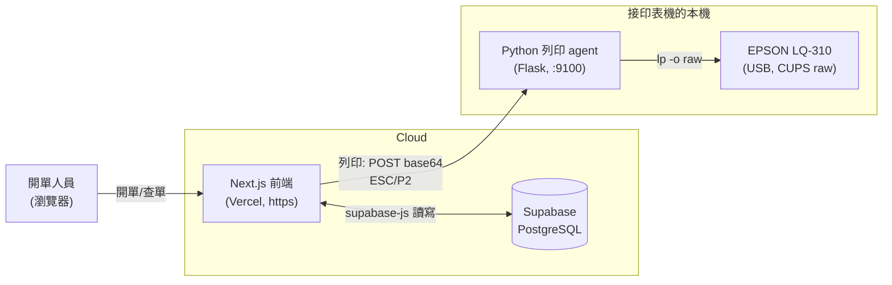

# 送貨單列印與雲端管理系統 技術架構藍圖

> 版本:v1.0 ｜ 日期:2026-07-03
> 專案類別:軟體/Web 系統開發
> 基礎:延續現有 MVP(本機送貨單列印),本次擴充為雲端可存查、可 autocomplete 的系統。

---

## 1. 專案概述

替使用點陣式印表機(EPSON LQ-310)開立三聯送貨單的公司,把現有「單機、記憶體、關機即消失」的列印工具,升級為一套**雲端可保存、可查詢、開單更快**的送貨單系統。

核心價值:
- **開單更快**:品名/規格 autocomplete,選一下自動帶入單位與單價,不必每次重打。
- **單據留底**:每張送貨單存進雲端資料庫,隨時查歷史、重印。
- **多台可用**:前端上雲,辦公室任一台電腦都能開單查單(列印仍由接印表機的本機負責)。

服務對象:公司內部開單人員(出貨/業務)。使用規模為小型內部系統,單一公司、少量並行使用者。

---

## 2. 需求摘要

### 功能性需求
- 沿用現有送貨單表單(抬頭 8 欄 + 品項多列 + 稅額 + X/Y 對位微調)與 LQ-310 ESC/P2 列印管線。
- 每張送貨單可**存檔**進雲端資料庫,含抬頭、品項、金額。
- 可**列出/查詢**歷史送貨單(依單號、客戶、日期),點開可**重新檢視與重印**。
- 建立**品名/規格主檔**,支援從 Excel/CSV **一次性匯入**現成清單。
- 開單時品名/規格欄位**即時 autocomplete**,選取後自動帶入單位、單價。
- 前端**部署上雲**(Vercel),多台裝置可存取;列印呼叫仍導向該台本機列印 agent。

### 非功能性需求
- **可用性**:內部系統,單一公司少量並行使用者;無高併發需求。
- **資料保存**:送貨單與品名主檔持久化於託管式 PostgreSQL(Supabase),含日常備份。
- **安全**:內部使用,本階段以 Supabase anon key + 限制性 RLS 政策管控,不做使用者登入(列為 Phase 2)。
- **相容**:列印路徑維持既有 ESC/P2 + CUPS `lp -o raw`,不改動印表機行為。
- **可維護**:延續現有 Next.js + TypeScript 架構與測試慣例,新增資料層以薄封裝隔離。

---

## 3. 系統架構

分層與職責:

- **前端(Next.js on Vercel)**:送貨單表單、預覽、送貨單清單/查詢、品名 autocomplete、觸發列印。直接以 supabase-js 讀寫資料層。
- **資料層(Supabase / PostgreSQL)**:三張核心表——送貨單(delivery_orders)、品項(do_lines)、品名主檔(products)。含 RLS 政策與備份。
- **列印 agent(Python Flask,本機)**:維持現狀。接收前端傳來的 ESC/P2 base64,透過 CUPS `lp -o raw` 送 LQ-310。必須跑在接印表機的那台機器。
- **第三方/基礎設施**:Supabase(託管 DB)、Vercel(前端部署)。

> ⚠️ 前端為 https(Vercel),列印呼叫需打到本機 `http://localhost:9100`。多數瀏覽器將 loopback(localhost)視為可信環境而放行 mixed-content,但需實測驗證;備案為 agent 端加自簽憑證或本機 tunnel。此風險反映在風險緩衝。

---

## 4. 技術選型

| 層級 | 選用技術 | 理由 |
|------|----------|------|
| 前端 | Next.js 16 + React 19 + TypeScript | 延續現有 MVP,零重寫成本;團隊已熟悉 |
| 資料層 | Supabase(託管 PostgreSQL)+ supabase-js | 快速上線、含備份與 REST/即時 API,免自建後端;符合小團隊/低成本 |
| 資料存取 | 前端直連 supabase-js + RLS | 內部小系統無需獨立後端 API 層,減少工時;以 RLS 控管存取 |
| 部署 | Vercel(前端)+ 本機 Flask agent | Next.js 原生託管;列印因實體印表機必須留在本機 |
| 列印 | 既有 ESC/P2 產生器 + CUPS `lp -o raw` | 已完成且驗證可印,不動 |
| 匯入 | 一次性 Node/Python 腳本讀 Excel/CSV → products 表 | 資料為現成清單,腳本最省工 |

---

## 5. 模組拆解(估價用)

> 現有 MVP(送貨單表單、ESC/P2 產生器、列印 agent、對位微調)**已完成,不列入本次報價**,僅作為基礎。以下為本次擴充範圍。

### 本次報價範圍(Phase 1)

| # | 模組 | 說明 | 複雜度 | 主要工作項 |
|---|------|------|--------|-----------|
| M1 | Supabase 建置與前端串接 | 建 Supabase 專案、設計 schema(送貨單/品項/品名三表)、RLS 政策、supabase-js 接進 Next.js、環境變數配置 | 中 | 建 DB、schema/migration、client 封裝、連線設定 |
| M2 | 送貨單存檔 / 清單 / 查詢 | 現有表單存進 DB、送貨單清單頁、依單號/客戶/日期查詢、點開重看與重印 | 中 | 存/讀 API 封裝、清單 UI、查詢篩選、重印串接 |
| M3 | 品名主檔 + Excel/CSV 匯入 | products 表 + 一次性匯入腳本讀客戶提供之現成清單 | 低–中 | 主檔 schema、匯入腳本、資料清洗與去重 |
| M4 | 品名 autocomplete | 開單品名/規格即時建議,選取帶入單位/單價 | 中 | 建議查詢、下拉 UI、選取帶值、鍵盤操作 |
| M5 | Vercel 部署 + 本機 agent 連線 | 前端部署、環境變數、非 localhost 的 CORS、mixed-content 處理與實測 | 中 | 部署設定、CORS 調整、列印連線實測與備案 |

### 選配 / Phase 2(本次不含,另附獨立估價)

| # | 模組 | 說明 | 複雜度 | 備註 |
|---|------|------|--------|------|
| P2-A | 舊歷史送貨單匯入 | 將既有紙本/舊系統送貨單資料遷入 DB | 中–高 | 工時依舊資料形式與筆數浮動大,需先看樣本 |
| P2-B | 使用者登入與權限 | 帳號登入、角色權限(RBAC) | 中 | 目前以 anon key + RLS 即可,如需稽核再做 |

---

## 6. 資料流與整合

**開單→存檔**:使用者於前端填單 → supabase-js 寫入 delivery_orders + do_lines。
**查單→重印**:清單/查詢頁讀 delivery_orders → 點開載回表單 → 走既有 ESC/P2 產生器 → POST base64 至本機 agent → CUPS 列印。
**品名 autocomplete**:輸入時查 products 表(前綴/模糊)→ 建議清單 → 選取寫回該列 name/unit/price。
**品名匯入**:客戶提供 Excel/CSV → 匯入腳本正規化 → 寫入 products(去重)。

資料表關係(概念):
- `delivery_orders`(1)──(N)`do_lines`
- `products`:autocomplete 來源,與 do_lines 為參考關係(選填帶值,不強制外鍵)

第三方整合點:Supabase(資料讀寫、Auth 保留未用)、Vercel(部署)。列印 agent 介面契約維持 `POST /print` + `GET /printers` 不變。

---

## 7. 風險與假設

### 技術風險與緩解
1. **https(Vercel)→ http(localhost)列印 mixed-content**:多數瀏覽器放行 loopback,但需實測;備案為 agent 自簽憑證或本機 tunnel。(已含於風險緩衝)
2. **中文 code page 列印**:現有 MVP 第一版以英數驗證通道為主;若品名含中文需確認 LQ-310 code page 對應。列為既有課題,非本次新增範圍主軸。
3. **點陣機對位偏移**:1–2mm 為天性,以既有 X/Y offset 微調吸收。
4. **Excel 清單品質**:欄位命名/單位不一致需清洗;假設客戶提供的清單為結構化、可辨識欄位。

### 假設與前提
- 客戶於約定時間提供**現成 Excel/CSV 品名規格清單**(結構化)。
- 使用規模為**單一公司、少量並行使用者**,無高併發。
- **不含使用者登入**;以 Supabase anon key + RLS 管控(Phase 1)。
- **不含舊歷史資料匯入**(列為 Phase 2 選配)。
- 列印維持既有本機 agent 架構,印表機為 EPSON LQ-310。
- 第三方費用(Supabase、Vercel)之付費方案(如有)由客戶負擔,不含於報價。

---

> 下一步:本藍圖第 5 節「模組拆解」將作為工時成本估算(effort-estimator)的直接輸入,產出人天與費用,再據以出正式報價單。
